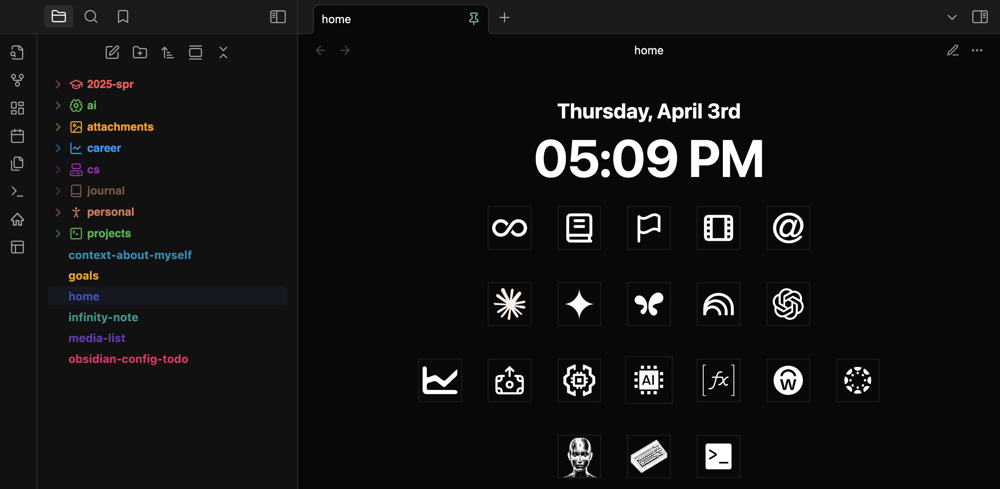
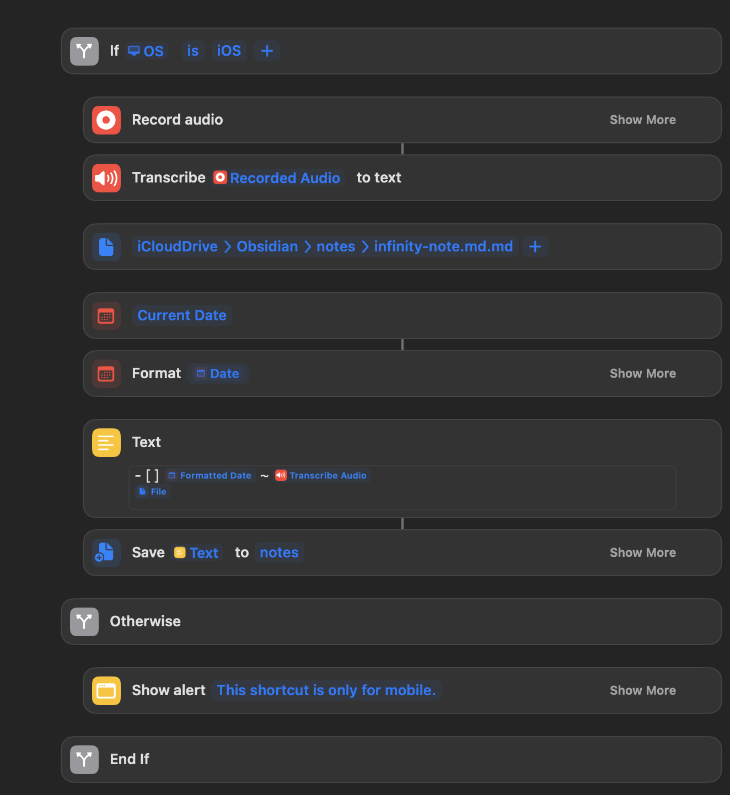
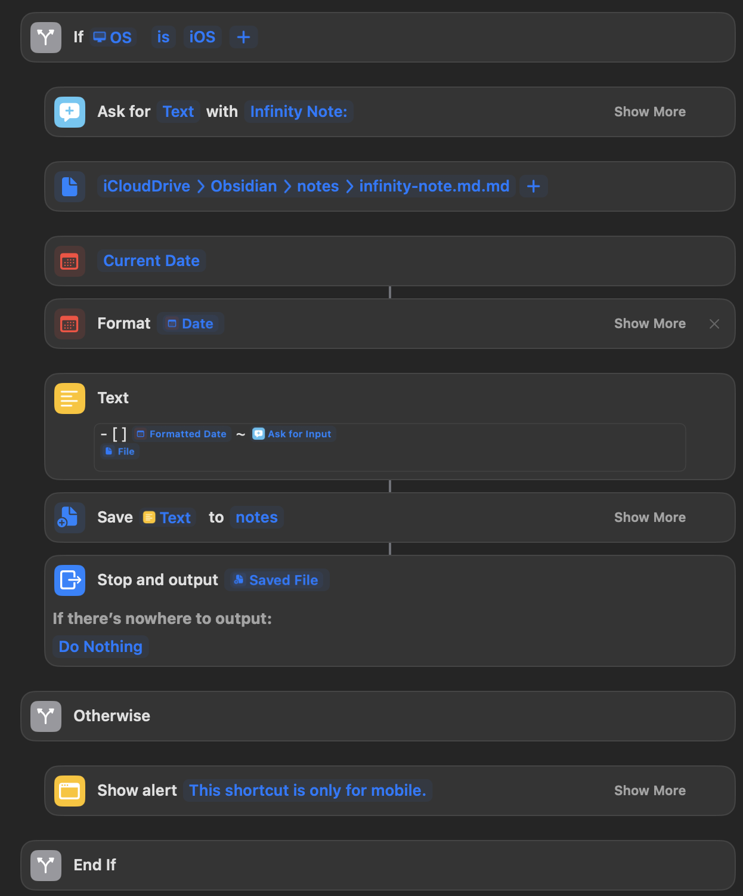

# Example Vault 2025-04-03

I switched over to obsidian pretty recently, and I have been messing around with configuration.

Obsidian is a markdown based text editor, and allows you to have your files locally on your computer. It's fully customizable allows you to use javascript, css and has a vast plugin ecosystem. The files being local allow for a lot more control automation and access.

I have all of my files crudely connected to claude using MCP:

The repo for that is here:

[Vault Connection Through MCP](https://github.com/andrewmccarthywustl/model-context-protocol-obsidian)

## My Vault

I put in some time customizing it, but I have many things to work out. I made all of the buttons in illustrator, the clock is dataviewjs.

## Append and Review Note

I was inspired by this post:

[Append and Review Data Structure](https://karpathy.bearblog.dev/the-append-and-review-note/)

On my home page I have the most recent 5 items and least recent 5 items from the list and I have found this to be an effective way to do the most urgent things whilst also forcing myself to do things I don't necessarily want to do.

Due to the file being a markdown file in my icloud drive I was able to set up some cool shortcuts that allow me to seamlessly add to it.

This shortcut prompts you to speak and prepends the transcribed text:

This does the same as a text input:

## Issues

The mobile syncing on obsidian is pretty bad when it's just stored in icloud so sometimes overrides the infinity note if I open the infinity note in obsidian mobile before I open it up on Desktop

Excalidraw is terrible so for handwritten notes I have to use a pdf editor like Notability and then export it into my folder. You could markup files directly in the files app on ipad, but you sometimes lose all of your progress and are stuck with blank pages, rather than lined paper.

## Next Steps

There is still a lot to do with the vault but I am quite proud of where it is at.

I will continue to improve the structure, flush out the styling of the of the home and create snippets for certain elements like summaries and such.

I will also experiment more with shortcuts, MCP Integrations, and scripts that could be useful
